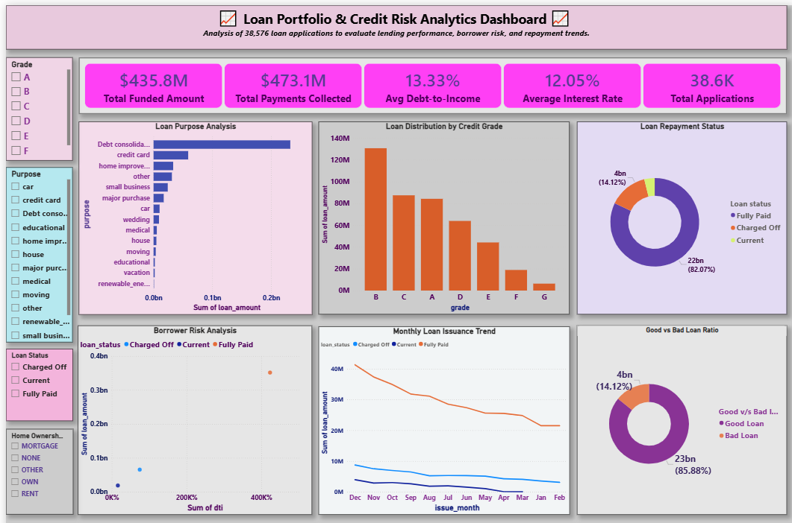

# 📊 Loan Portfolio & Credit Risk Analytics Dashboard

## 🔎 Project Overview

This project analyzes **38,576 bank loan records** to evaluate **loan portfolio performance, borrower behavior, and credit risk patterns**.

The objective is to transform raw financial data into **actionable insights** that support **data-driven lending decisions, risk management, and portfolio optimization**.

The project integrates **Excel, Python (Jupyter Notebook), and Power BI** to perform:

* Data cleaning & transformation
* Exploratory Data Analysis (EDA)
* Interactive dashboard development

---

# 🎯 Project Objectives

* Analyze **loan distribution and borrower characteristics**
* Evaluate **credit risk using DTI, loan status, and credit grades**
* Identify **high-risk borrower segments**
* Monitor **loan performance and repayment trends over time**
* Build **interactive dashboards for business decision-making**

---

# 🛠 Tools & Technologies

| Tool                      | Purpose                                        |
| ------------------------- | ---------------------------------------------- |
| Excel                     | Data cleaning, KPI creation, dashboard         |
| Python (Jupyter Notebook) | Exploratory Data Analysis (EDA)                |
| Power BI                  | Interactive dashboards & business intelligence |
| Pandas                    | Data manipulation                              |
| NumPy                     | Statistical analysis                           |
| Matplotlib & Seaborn      | Visualization                                  |
| Plotly                    | Interactive charts                             |

---

# 📂 Project Structure

```
Bank-Loan-Risk-Analysis
│
├── data
│   ├── raw
│   │   └── bank_loan_raw_data.xlsx
│   └── processed
│       └── cleaned_bank_loan.csv
│
├── notebooks
│   └── loan_analysis.ipynb
│
├── excel_dashboard
│   └── Bank_Loan_Dashboard.xlsx
│
├── powerbi_dashboard
│   └── Bank_Loan_Dashboard.pbix
│
├── images
│   └── dashboard_preview.png
│
└── README.md
```

---

# 📊 Dataset Description

The dataset contains **38,576 loan applications** with multiple borrower and financial attributes.

### Key Variables

| Variable      | Description               |
| ------------- | ------------------------- |
| loan_amount   | Total loan issued         |
| int_rate      | Interest rate (%)         |
| annual_income | Borrower annual income    |
| dti           | Debt-to-Income ratio      |
| loan_status   | Loan repayment status     |
| grade         | Credit risk grade (A–G)   |
| purpose       | Loan purpose              |
| total_payment | Total repayment collected |

---

# 🧹 Data Cleaning & Feature Engineering

Key preprocessing steps:

* Removed duplicates & handled missing values
* Converted date fields into time-based features
* Standardized financial variables
* Created new analytical columns:

  * **Loan Risk Category (High vs Low Risk)**
  * **Income Group Segmentation**
  * **Good vs Bad Loan Classification**

---

# 📈 Exploratory Data Analysis (Python)

EDA was performed using Python to uncover patterns in borrower behavior and risk.

### Key Analysis

* Loan status distribution (Fully Paid vs Charged Off)
* Credit grade vs loan amount
* Income vs borrowing behavior
* Interest rate vs risk level
* DTI impact on loan default probability
* Correlation between financial variables

---

# 📊 Power BI Dashboard

An interactive dashboard was built to monitor **loan performance and credit risk**.

### 🔹 Key KPI Metrics

* 💰 Total Funded Amount: **$435.8M**
* 💳 Total Payments Collected: **$473.1M**
* 📈 Avg Interest Rate: **12.05%**
* ⚠ Avg Debt-to-Income (DTI): **13.33%**
* 📄 Total Applications: **38.6K**

---

## 📉 Dashboard Insights

### 📌 Loan Portfolio Analysis

* Majority of loans belong to **Grade B and C**, indicating moderate-risk borrowers
* High-grade loans (A–B) dominate total lending volume

---

### 📌 Loan Purpose Analysis

* **Debt consolidation** is the most common loan purpose
* Indicates borrowers are using loans to **manage existing debt**

---

### 📌 Credit Risk Insights

* Higher **DTI ratios** correlate with increased default probability
* **Charged-off loans** are concentrated in lower credit grades

---

### 📌 Repayment Performance

* Majority of loans are **Fully Paid**, indicating strong portfolio health
* Low proportion of **charged-off loans** suggests controlled risk exposure

---

### 📌 Time-Based Trends

* Loan issuance shows **consistent but slightly declining trend over time**
* Indicates potential change in **credit demand or lending strategy**

---

### 📌 Risk Analysis

* Scatter analysis reveals:

  * High DTI + High Loan Amount = **Higher default risk zone**
  * Low DTI borrowers show better repayment behavior

---

# 📷 Dashboard Preview



---

# 💡 Business Value

This project demonstrates how analytics can:

* Identify **high-risk loan segments**
* Improve **credit decision-making**
* Monitor **loan portfolio health**
* Support **risk-based pricing strategies**
* Enable **data-driven financial insights**

---

# 🚀 Future Improvements

* Build **Machine Learning model for default prediction**
* Add **SQL-based data pipeline**
* Create **automated Power BI refresh**
* Enhance dashboard with **geographical analysis (loan by state)**

---

# 👨‍💻 Author & Contacts

**Samiul Gazi** | 🎓 M.Sc Economics — University of Calcutta
📊 Data Analytics | Credit Risk | Financial Analysis

📧 Email: sgaziamumh@gmail.com
🔗 LinkedIn: linkedin.com/in/samiul-gazi
🌐 GitHub: github.com/Samiul1947

---

# ⭐ If you found this project useful

Please ⭐ star the repository and share your feedback!
